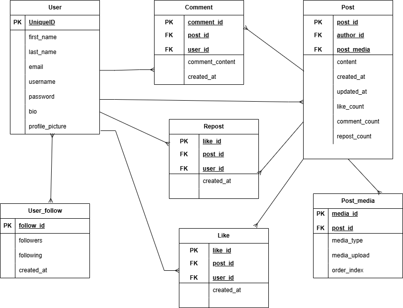

# MedLoveScience Social Media Feed (Backend Service)
The MedLabScience Social Media Feed is a real-time backend system designed to support a modern, science-focused social networking platform for Medical Laboratory Science students, scientists, and lecturers.

This service enables users to create and manage posts, interact through comments, likes, and reposts, and stay connected through instant, real-time updates tailored to the scientific and academic community.
* Built to facilitate meaningful engagement, the platform allows users to:
* Share insights and discoveries
* Discuss laboratory procedures and best practices
* Follow peers, mentors, and professionals
* Participate in academic and professional conversations

This backend provides the core infrastructure needed to power a reliable, scalable, and interactive social media experience for the MedLabScience community.

## Features
**User System:** The platform provides a secure and reliable user system that supports account registration and authentication, profile management, and the ability for users to follow or unfollow others within the Medical Laboratory Science community.
**Posts:** Users can create, edit, and delete posts, share scientific insights or laboratory experiences, attach media, and receive real-time updates as new content becomes available.
**Interactions:** The system enables users to engage meaningfully with content by commenting on posts, liking or unliking them, reposting information to their own feed, and saving or bookmarking posts for future reference.
**Notifications System:** A robust notification system delivers real-time alerts for likes, comments, reposts, new followers, mentions, and other key activities, ensuring users stay connected and informed at all times.

## Prerequisites
Python 3.8+
PostgreSQL
Git

## Technologies Stack
Django
GraphQL
Token-based Authentication
PostgreSQL
Swagger (via drf-yasg)

## Database Schema (ERD)
